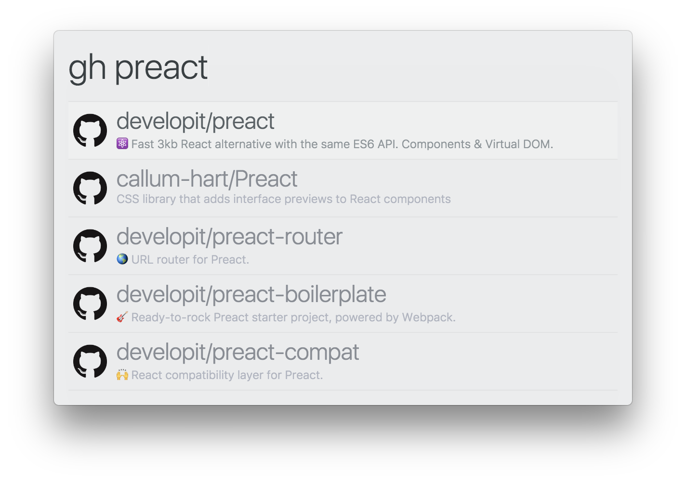

# zazu-github

> [Zazu](https://github.com/tinytacoteam/zazu) plugin to search for GitHub repositories with [github.com](https://github.com)

[](https://travis-ci.org/danielbayerlein/zazu-github)
[](https://codecov.io/gh/danielbayerlein/zazu-github)

## Usage

To search GitHub repositories simply type `gh` then the name of the repository to search for.
For example `gh preact`.



## Install

Add `danielbayerlein/zazu-github` inside of plugins block of your `~/.zazurc.json` file.

```json
{
  "plugins": [
    "danielbayerlein/zazu-github"
  ]
}
```

## License

Copyright (c) 2017 Daniel Bayerlein. See [LICENSE](./LICENSE.md) for details.
